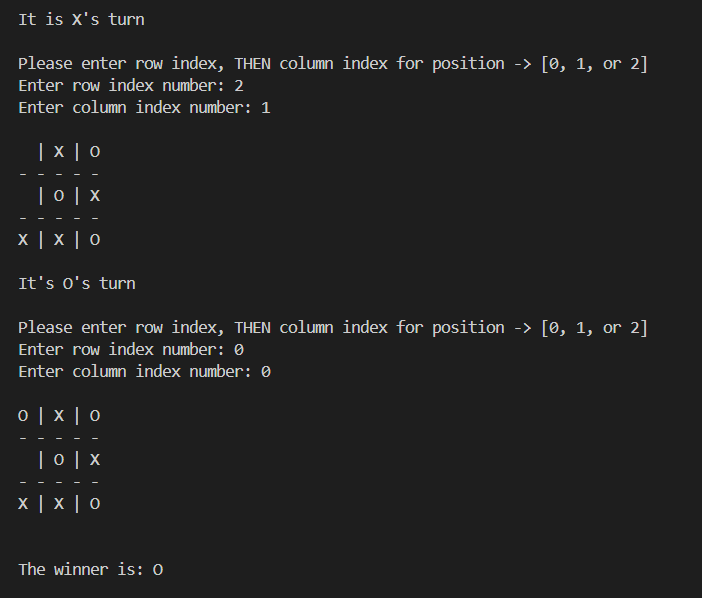

 
  <h1>🕹️  Noughts and Crosses in C++</h1>

  

This is a simple console-based implementation of the classic Tic-Tac-Toe game using C++. 

The game is designed for two players and runs in the terminal. 

It features basic input validation, win detection (rows, columns, diagonals), and draw conditions.

  

## 📸 Sample Output

  

## 🎮 Features
- 3x3 game board
- Player turn tracking (X and O)
- Input validation for cell occupation
- Win detection (horizontal, vertical, diagonal)
- Detects draws ("Cat's game")

  

## 🔮 Future Improvements
- Split code into multiple files (e.g., Game.h, Game.cpp, main.cpp)
- Add player name input
- Include a replay feature after the game ends
- Improve board visuals with coordinates and colors -> using a graphics library
- Implement a simple AI opponent for solo play

  

## ⭐ Contributing 
Contributions are welcome! If you find any issues or improvements, feel free to open an issue or submit a pull request.

  

## Contact / Acknowledgments
All code is written by Oluwatobi Emmanuel.
